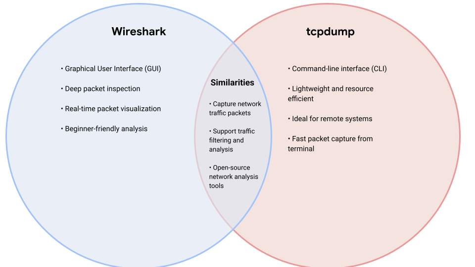

# Wireshark vs tcpdump Analysis

## Overview

This project compares two widely used network traffic analysis tools: Wireshark and tcpdump.

The objective is to identify key differences, similarities, use cases, and security applications of each tool. The comparison helps cybersecurity analysts determine which tool is most appropriate for different network monitoring and incident investigation scenarios.

---

## Tools Evaluated

### Wireshark

Wireshark is a graphical network protocol analyzer that allows analysts to capture, inspect, and analyze network traffic in real time through a user-friendly interface.

### tcpdump

tcpdump is a command-line packet analyzer commonly used on Linux and Unix systems for capturing and filtering network traffic efficiently.

---

## Comparison Diagram

---

## Key Findings

- Wireshark provides advanced graphical packet analysis.
- tcpdump offers lightweight command-line packet capture.
- Both tools support packet filtering and traffic analysis.
- Both are commonly used during network troubleshooting and incident response investigations.

---

## Security Concepts

- Packet Capture
- Traffic Analysis
- Protocol Inspection
- Network Monitoring
- Incident Response
- Network Troubleshooting

---

## Repository Structure

- `wireshark-analysis.md`
- `tcpdump-analysis.md`
- `comparison-summary.md`

Supporting documentation is stored in the `docs/` directory.

---

## References

- https://www.wireshark.org/docs/wsug_html/
- https://www.tcpdump.org/index.html#documentation
